# Balloon Blocks

A [Minetest](https://www.minetest.net/) mod that adds balloon blocks which can be placed in the air.

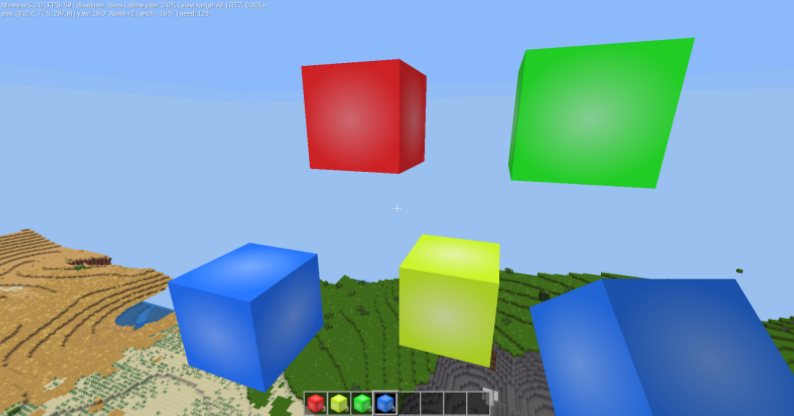

## Description

Have you ever wanted to build a big house in the sky, but you can't because it would take ages to build up from the ground.

Now you can!

The balloon blocks can be placed in the air.
This means it is now easy to place a block up in the sky.

When placing a balloonblock in the air it is always placed three blocks away from your current position.
If you can fly, then you don't have to build to place a node. You can just fly up and place a balloonblock!

## Gallery

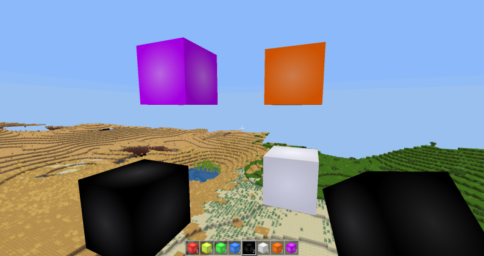

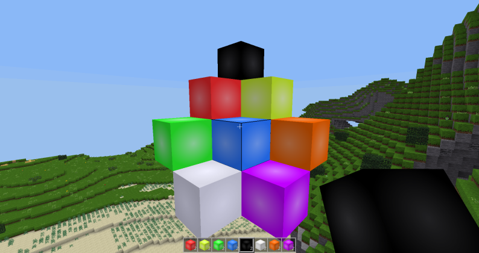

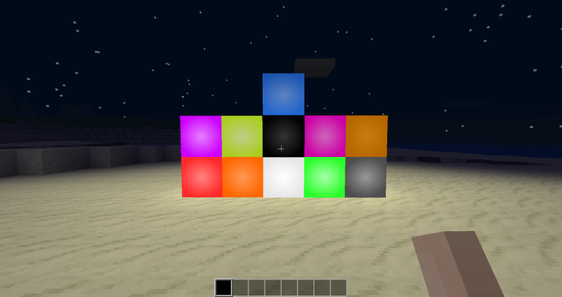

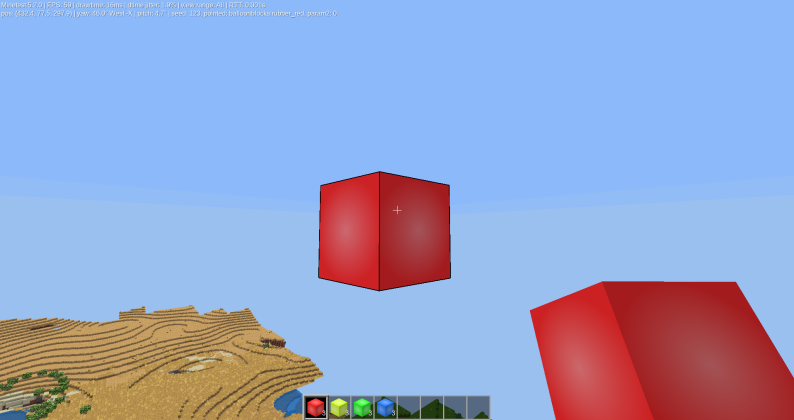

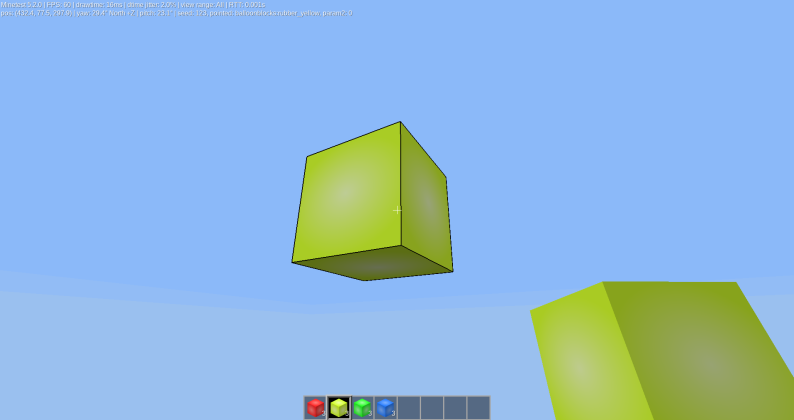

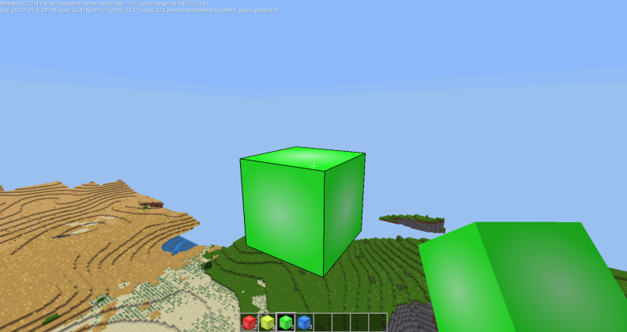

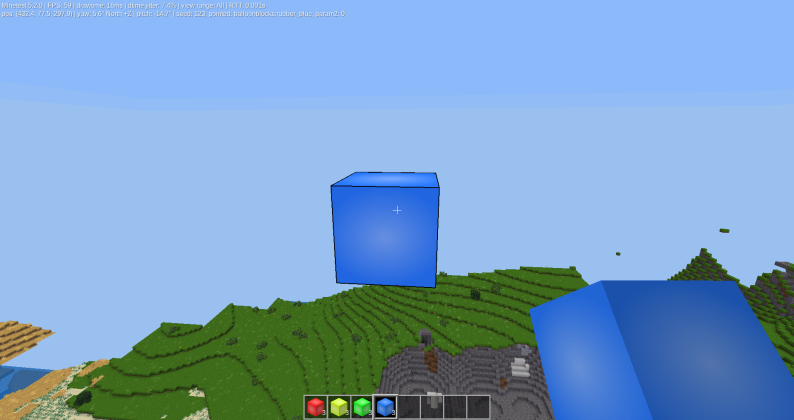

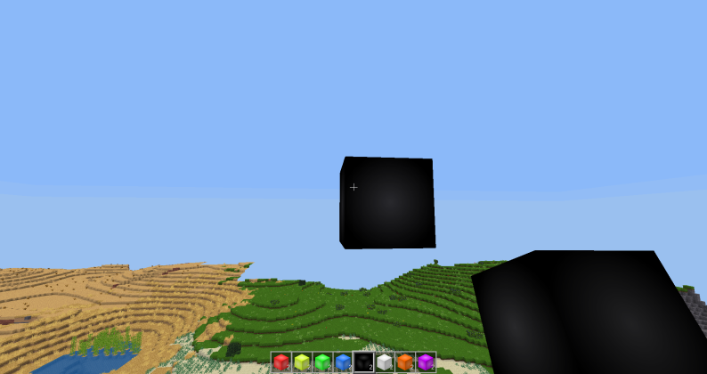

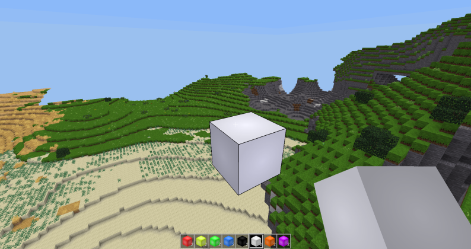

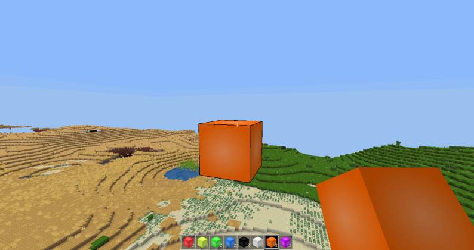

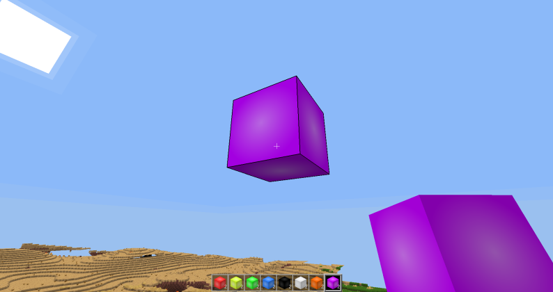

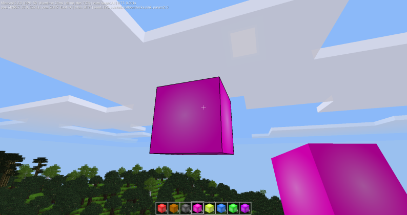

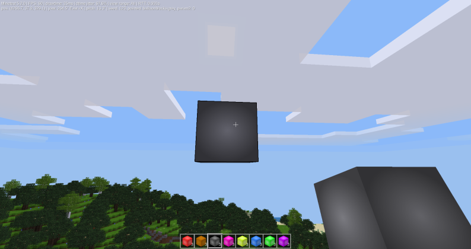

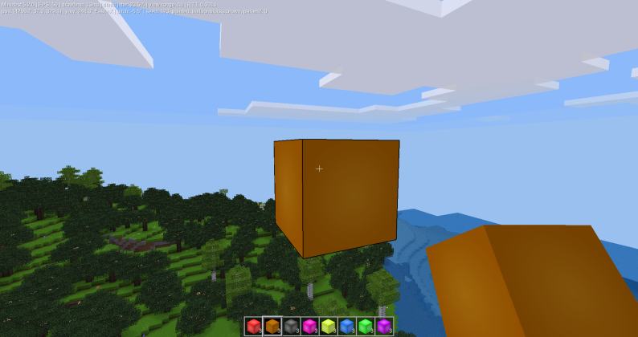

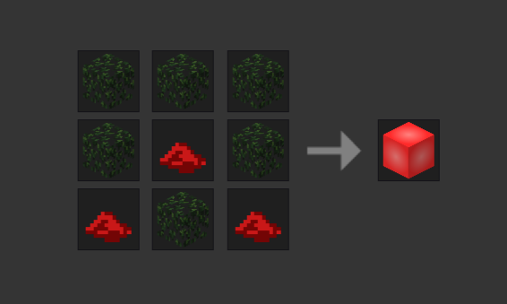

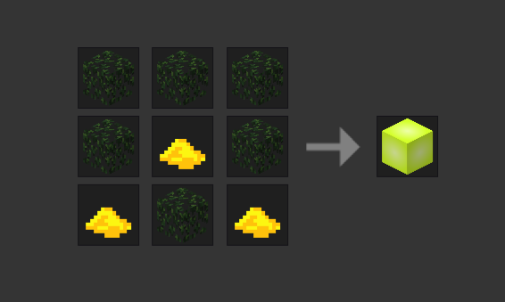

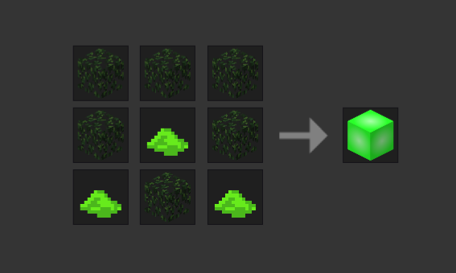

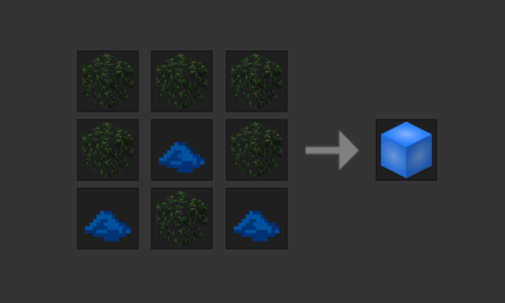

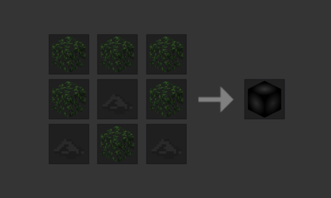

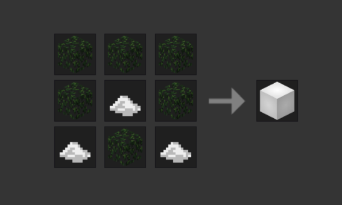

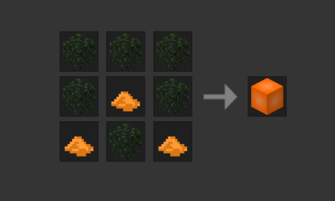

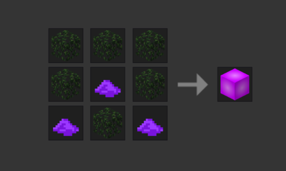

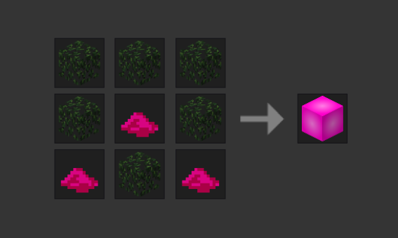

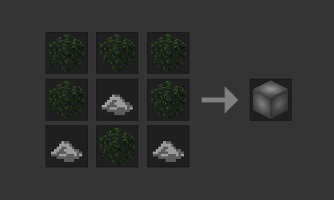

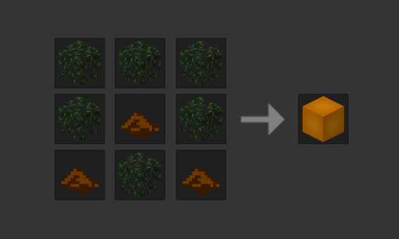

## Installing

There are three ways to [install](https://wiki.minetest.net/Installing_Mods) the balloonblocks mod:

### Minetest GUI Installation

It is possable to install it without closing the game.

1. In the minetest menu, click on the tab titled **Content**.
1. At the bottom click on **Browse online content** (it may take a while).
1. Search for **balloon**.
1. Find the mod called **Balloon blocks**.
1. Click the **Install** button on the right.
1. You will get a message saying **Downloding and installing Balloonblocks, please wait...**.

You have now installed the balloonblocks mod, don't forget to enable it.

### Zip File Installation

1. Use the website [ContentDB](https://content.minetest.net/packages/?q=balloonblocks).
1. Find the mod titled **Balloon blocks**, then click on it.-
1. Find a green button titled **Download** and click on it.
1. Now follow the [wiki instructions](https://wiki.minetest.net/Installing_Mods).

You have now installed the balloonblocks mod, don't forget to enable it.

### Git Installation

1. Install [Git](https://git-scm.com/).
1. Open a command prompt on your computer.
1. Change directory into [minetest mod directory](https://wiki.minetest.net/Installing_Mods).
1. Then type `git clone https://github.com/TBSHEB/minetest-balloon-blocks.git` and hit enter.

You have now installed the balloonblocks mod, don't forget to enable it.

## Change Log

* 2020-06-20: v1.3.0 - Added glowing balloonblocks of all colours
* 2020-06-18: v1.2.0
  * Added grey, pink, and brown balloonblocks
  * Added bounce attribute
  * Added more crafting recipes
  * Fixed block replacement bug
* 2020-06-11: v1.1.0 - Added black, white, orange, and purple balloonblocks
* 2020-06-09: v1.0.0 - Initial release

## License

MIT License
