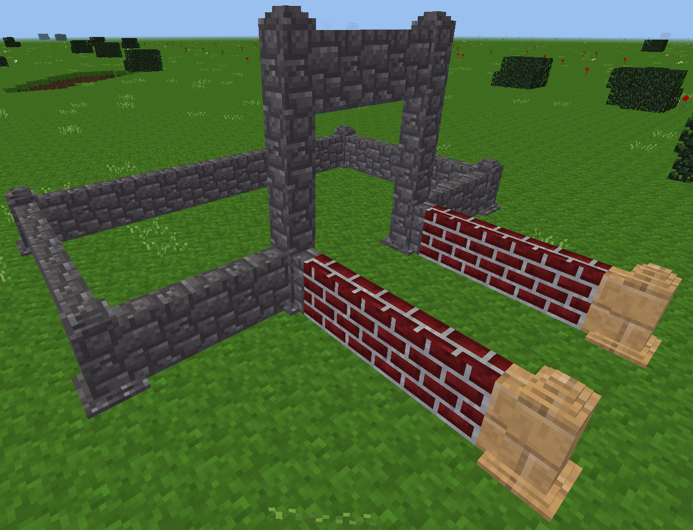
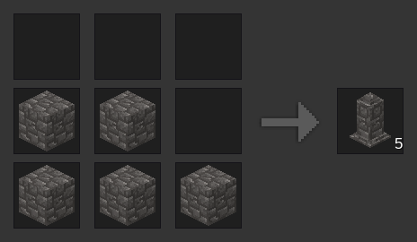
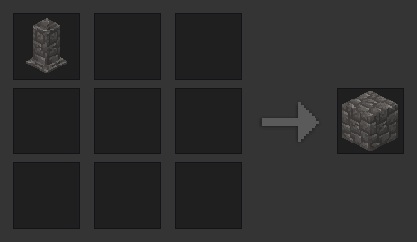

*Super Duper Walls* or *SD Walls* for short adds modular flexible walls to Minetest.



## Functionality

The mod adds walls from various different base nodes like cobblestone or stone bricks. The walls automatically connect to all other walls created by *SD Walls*.

In addition to that wall pillars are automatically created where applicable.

* At all corners
* At all T-junctions
* At all wall ends
* If the wall stands alone
* If the wall is surrounded by other walls

If a wall is not in one of the above positions it will automatically convert to a neatly fitting wall part connecting to the neighboring wall parts.

If you want to use a pillar/wall where usually a wall/pillar would be placed just punch the wall while wielding a wall. The punched wall will then toggle between the pillar form and the wall form.

Please note: This toggled type will be updated according to the neighbors when placing a wall adjacent to the toggled wall and has to be re-set as wanted at no cost.

## Crafting

Crafting walls from the *SD Walls* mod is similar to crafting the regular walls except the top right node. An “uncrafting” recipe also exists.

 

Feel free to report an issue if this interferes with any of your other mods.

## Configuration

### Walls to generate

SD Walls allows to set some of the walls not being created for whatever reason. Also the initially provided wooden walls are not created by default due to logic reasons (walls are made from bricks and not from wood). This can be set using the advanced configuration or adding the following values to `minetest.conf` and setting them to false (respectively `true` for the wooden walls.

    sdwalls_use_default_wood        = false  -- Disabled by default
    sdwalls_use_default_sandstone   = true
    sdwalls_use_default_cobblestone = true
    sdwalls_use_default_bricks      = true
    sdwalls_use_moreblocks_bricks   = true

If disabled later the already placed nodes stay as they are and render as unknown nodes in the world until enabled again or manually removed from the world.

### Connect to the base node

By default the walls and pillars connect to their respective base nodes (cobblestone walls connect to cobblestone nodes, stone brick walls to stone brick nodes, etc.). Connections between different nodes are not made (e.g. cobblestone walls do not connect to stone brick walls.

    sdwalls_connect_to_base = true

Those features are server-wide and cannot be controlled for individual walls. Set to `false` to disable this feature. A pillar is generated at the end of the wall and the pillar connects to the base node. To have a wall there you need to toggle it.

### Connect to walls of same type only

This setting allows to disable the connection between different wall types. By default walls of different types do connect. If this is not wanted simply set the value to `true` so walls only connect to theirselves.

    sdwalls_connect_to_self = false  -- Disabled by default

For the sake of simplicity of this mod this feature only controls the connection nodebox to use. When set and two different walls meet they still prepare to connect (i.e. pillar generated at meeting point, wall generated to connect to the pillar), they just don’t connect anymore.

You need to manually toggle the walls/pillars to match their surroundings.

## API

*SD Walls* comes with a tiny API that allows modders to add walls to their own mods by simply registering them as described below. Mods need to depend or opt-depend on `sdwalls` in order to use the API.

The easiest method to register a wall is simply providing a node ID. This registers the wall based on that node ID with all of the node’s features. The call needs to be made after the mod registers the node otherwise *SD Walls* will simply ignore it.

```
sdwalls.register('mymod:mynode')
```

It is also possible to configure the registration for the wall providing a definition table. All table entries are optional.

```
sdwalls.register('mymod:mynode', {
  name = 'My Cool Wall Name',  -- name for the wall/pillar
  groups = {},                 -- additional groups
  pillar = pillar_table,       -- configuration for the pillar
  wall = wall_table,           -- configuration for the wall
})
```

The `groups` entry can be a regular groups table. All of the groups are added to the registered wall and pillar nodes. The `wall_table` and `pillar_table` tables can be used to override some of the base node’s properties. The tables are identical for the `pillar` and the `wall` entry in the definition table.

```
{
  tiles = tiles_definition_table,  -- override tiles
  sounds = SimpleSoundSpec,        -- override sounds
  light_source = 1                 -- override light source setting
}
```

The `tiles` and `sounds` tables are the same that are used to register nodes with the Minetest API. See Minetest API documentation on how to set those up. The `light_source` value is the same as for registering nodes with the Minetest API, too.
