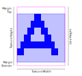
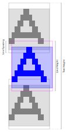

# Font API
This document describes Font API. Font API creates textures for font display on entities.

## Settings
### default_font
Name of the font to be used when no font is given. The font should be registered.

If no default\_font given or if default\_font given but not registered, the first registered font will be used as default.

## Use font_api with display_api (to display text on nodes)
### Base setup
Font_api offers a direct integration with display_api to display text on nodes.

First of all, create a display node with an entity.
To do this, refer to API.md in display_api mod, in particular "Howto register a display node".

The only requirement then is to connect the `on_display_update` callback of the display entity to `font_api.on_display_update`:

```
minetest.register_node("mymod:test_text_node", {
	...
	paramtype2 = "facedir",
	...
	groups = { display_api = 1, ... },
	...
	display_entities = {
		["mymod:text"] = {
			depth = -0.5 - display_api.entity_spacing,
			on_display_update = font_api.on_display_update },
	}
	...
	on_place = display_api.on_place,
	on_construct = display_api.on_construct,
	on_destruct = display_api.on_destruct,
	on_rotate = display_api.on_rotate,
	...
})
```

At this step, your node already displays text form "display_text" (by default) node meta. If you want to store your text into another meta data field, add a `meta_text` field to display entity definition.

But it uses defaults (default font, default size, default color). Likely you need something more.

### Style your text
Font style and size can be chosen by adding some more entries to the display_entities definition table.

#### Font size
Font size can be defined in various ways (maybe more in the future).
Start with a number of lines, and font_api will make it fit to the entity size.
  * `maxlines` or `lines`: Number of maximum lines of text to be displayed. The font height will be adjusted accordingly.

Then specify the char width. Two methods available:
  * `aspect_ratio`: Defines the aspect ratio of chars. Works with all fonts. Should not be used if `columns` is specified.
	* `columns`: Only if using a fixed width font, specifies the number of columns to display.

#### Font style
  * `font_name`: name of the font to use. Should correspond to a registered font (from a font mod). If not specified or font not found, default font is used.
  * `color`: color to be used (default black).
  * `halign`: Horizontal alignment: "left", "center" or "right" (default "center").
  * `valign`: Vertical alignement: "top", "middle" or "bottom" (default "middle").

### Example
Using blue //botic// font, three lines height, aligned top left. Text stored in "text" node meta.
```
minetest.register_node("mymod:test_text_node", {
	...
	...
	display_entities = {
		["mymod:text"] = {
			depth = -0.5 - display_api.entity_spacing,
			on_display_update = font_api.on_display_update
			meta_text = "text",
			font_name = "botic",
			color = "#0000FF",
			maxlines = 3,
			aspect_ratio = 0.5,
			halign = "left",
			valign = "top",
			},
	}
	...
})
```
## Provided methods
### font_api.get_default_font_name()
Returns de default font name.

### font_api.register_font(font_name, font_def)
Register a new font.
  * `font_name`: Name of the font to register. If registering different sizes of the same font, add size in the font name (e.g. times_10, times_12...).
  * `font_def`: Font definition table (see **Font definition table** below).

### font_api.on_display_update(pos, objref)
Standard on_display_update entity callback.
  * `pos`: Node position
  * `objref`: Object reference of entity

Node should have a corresponding display_entity with size, resolution and maxlines fields and optionally halign, valign and color fields.

## Font definition table
Font definition table used by **font_api.register_font** and **font\_api.Font:new** may/can contain following elements:

* `height` (required): Font height in pixels (all font textures should have the same height) .
* `widths` (required): Array of character widths in pixels, indexed by UTF codepoints.
* `margintop` (optional): Margin (in texture pixels) added on top of each char texture.
* `marginbottom` (optional): Margin (in texture pixels) added at bottom of each char texture.
* `linespacing` (optional): Spacing (in texture pixels) between each lines.

`margintop`, `marginbottom` and `linespacing` can be negative numbers (default 0) and are to be used to adjust various font styles to each other.

Font attributes around a single char:\


Font attributes effects on several lines:\


#### Additional requirements

Font must have a char 0 which will be used to display any unknown char.

All textures corresponding to the indexes in widths array should be present in textures directory with a name matching the pattern :

> font\_**{font_name}**_**{utf_code}**.png

**{font\_name}**: Name of the font as given in the first argument

**{utf\_code}**: UTF code of the char in 4 hexadecimal digits

Example : font_courrier_0041.png is for the "A" char in the "courrier" font.

To ease that declaration (specially to build the **widths** array), a shell is provided to build a {font\_name}.lua file from the texture files (see provided tools).

## Provided tools

Still in early stage of development, these tools are helpers to create font mods.

### make_font_texture.sh

This scripts takes a .ttf file as input and create one .png file per char, that can be used as font texture. Launch it from your future font mod directory.

__Advice__

This script works much better with pixels font, providing the correct height. There is no antialiasing at all, vector fonts and bad heights gives very ugly results.

__Syntax__

**make\_font\_texture.sh {fontfile} {fontname} {fontsize}**

**{fontfile}**: A TTF font file to use to create textures.
**{fontname}**: The font name to be used in font_api (should be simple, with no spaces).
**{fontsize}**: Font height to be rendered.

### make_font_lua.sh

This script analyses textures in textures directory and creates a font\_{font\_name}.lua files with a call to register_font with images information. Launch it from your future font mod directory.

Once the font\_{font\_name}.lua created, it can be included by a init.lua file or directly renamed to init.lua if you are creating a simple font mod.

__Syntax__

**make\_font_lua.sh {fontname}**

**{fontname}**: The font name to be used in font_api (same as given to make\_font\_texture.sh)

### An exemple generating a font mod

    mkdir font_myfont
    cd font_myfont
    /<path_to_font_api>/tools/make_font_texture.sh myfont.ttf myfont 12
    /<path_to_font_api>/tools/make_font_lua.sh myfont
    mv font_myfont.lua init.lua

## Font class
A font usable with font API. This class is supposed to be for internal use but who knows.

### font\_api.Font:new(def)
Create a new font object.
  * `def` is a table containing font definition. See **Font definition table** above.

### font:get_char_width(codepoint)
Returns the width of char `codepoint` in texture pixels.
  * `codepoint`: Unicode codepoint of char.

### font:get_height(nb_of_lines)
Returns line(s) height. Takes care of top and bottom margins and line spacing.
  * `nb_of_lines`: Number of lines in the text.

### font:get_width(line)
Returns the width of a text line. Beware, if line contains any new line char, they are ignored.
  * `line`: Line of text which the width will be computed.

### font:renter(text, texturew, textureh, style)
Builds texture for a multiline colored text.
  * `text`: Text to be rendered.
  * `texturew`: Width of the texture (extra text will be truncated).
  * `textureh`: Height of the texture (extra text will be truncated).
  * `style`: A table with style indications:
    - `lines` or `maxlines`: Maximum number of lines (default none).
    - `halign`: Horizontal text align: "left"/"center"/"right" (default "center")
    - `valign`: Vertical text align: "top"/"middle"/"bottom" (default "middle")
    - `color`: Color of the text (default black)
